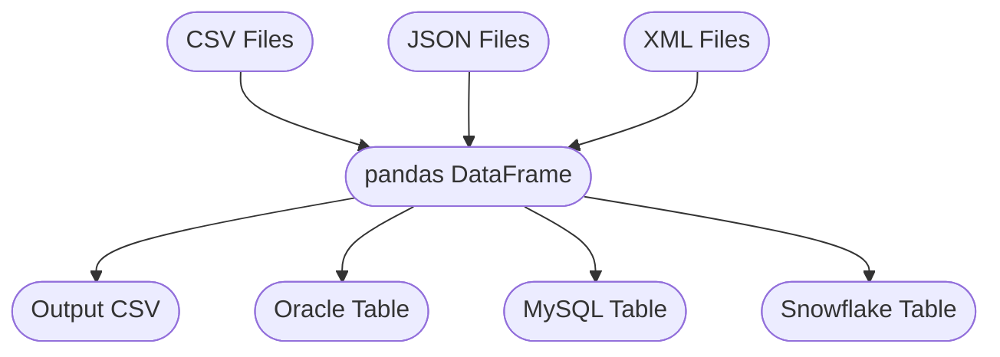

# ETL Pipeline: Read CSV, JSON, XML to Oracle, MySQL, Snowflake

## Overview
This project implements an ETL pipeline that reads data from multiple file formats (CSV, JSON, XML), consolidates them into a single pandas DataFrame, and loads the data into Oracle, MySQL, and Snowflake databases. The pipeline is designed for flexible, multi-source data integration.

## Architecture / Workflow



## Project Structure
- **etl_read_csv_jason_xml_to_oracle_mysql_snowflakes_production.py**: Main ETL script for reading, transforming, and loading data.
- **Inventory.csv, source1.csv, source2.csv, source3.csv**: Example CSV files.
- **source1.jason, source2.jason, source3.jason**: Example JSON files.
- **source1.xml, source2.xml, source3.xml**: Example XML files.
- **transformed_data.csv**: Output of the consolidated DataFrame.
- **log_file.txt**: Log file for ETL operations.
- **HR.sql, mySQLCreateTable_person_lower_case.sql**: Example DDL scripts for target tables.
- **STAFF.db**: Example SQLite DB (if used).
- **readme.txt**: Project notes.

## Setup
1. Install Python 3.x.
2. Install dependencies:
   ```
   pip install pandas numpy oracledb mysql-connector-python snowflake-snowpark-python
   ```
3. Configure database credentials in the script.
4. Place all source files in the project directory.

## Process
1. **Extract**: Read all CSV, JSON, and XML files from the directory into pandas DataFrames.
2. **Transform**: Concatenate all data into a single DataFrame and output to a CSV file.
3. **Load**: Insert the consolidated data into Oracle, MySQL, and Snowflake tables.

## Output / Results
- Data is available in Oracle, MySQL, and Snowflake tables.
- Consolidated CSV output for further use.
- Log file for monitoring ETL steps.

## Technologies Used
- Python (pandas, numpy)
- Oracle Database
- MySQL
- Snowflake
- CSV, JSON, XML
