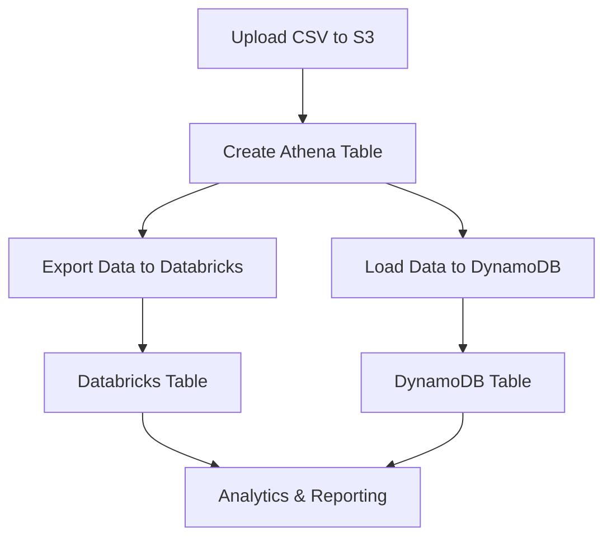

# ETL Pipeline: AWS Athena, Databricks, DynamoDB

## Overview
This project implements an ETL pipeline that ingests revenue data from a CSV file, loads it into AWS S3, creates an Athena table, exports the data to Databricks, and loads it into a DynamoDB table. The goal is to automate and streamline data movement and analytics across AWS and Databricks platforms.

## Architecture / Workflow



## Project Structure
- **etl_aws_db_athena_databricks_dynamodb_production.py**: Main ETL script for the pipeline.
- **requirements.txt**: Python dependencies.
- **revenue_per_month.csv**: Source data file.
- **etl_pipeline.log**: Log file for ETL operations.
- **readme**: Project documentation.

## Setup
1. Install Python 3.x.
2. Install dependencies:
   ```
   pip install -r requirements.txt
   ```
3. Configure AWS credentials and Databricks connection (see environment variables in the script).
4. Place `revenue_per_month.csv` in the project directory.

## Process
1. **Upload CSV to S3**: Place the revenue CSV file in the specified S3 bucket.
2. **Create Athena Table**: Use the CSV to create the `revenue_per_month` table in Athena.
3. **Export to Databricks**: Move data from Athena to a Databricks table for analytics.
4. **Load to DynamoDB**: Load the CSV data into a DynamoDB table for fast access.

## Output / Results
- Data available in:
  - **DynamoDB Table**: [revenue_per_month](https://us-east-2.console.aws.amazon.com/dynamodbv2/home?region=us-east-2#item-explorer?maximize=true&table=revenue_per_month)
  - **Athena Table**: [revenue_per_month](https://us-east-2.console.aws.amazon.com/athena/home?region=us-east-2#/query-editor/history/8691b33d-0732-43c2-bad7-b33c9f4f0b1d)
  - **Databricks Table**: [revenue_yyyymm_ui](https://dbc-a8cc44ec-b1d1.cloud.databricks.com/explore/data/workspace/default/revenue_yyyymm_ui?o=4496599915693478&activeTab=sample)
- Log file: `etl_pipeline.log` for monitoring ETL steps.

## Technologies Used
- AWS S3
- AWS Athena
- AWS DynamoDB
- Databricks
- Python (boto3, awswrangler, pandas, databricks-sql-connector)
