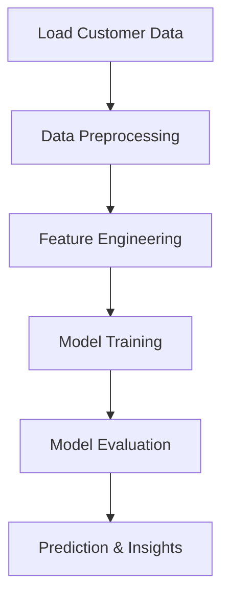

# AI Customer Churn Prediction

## Overview
This project aims to predict customer churn using machine learning techniques. The goal is to help businesses identify customers likely to leave, enabling proactive retention strategies.

## Architecture / Workflow



## Project Structure

- **CustomerChurnPredict.py**: Main Python script for data processing, model training, and evaluation.
- **CustomerChurnPredict.ipynb**: Jupyter notebook for interactive data exploration and model development.
- **CustomerChurnPredictNotebook.ipynb**: Additional notebook for alternative analysis or experimentation.
- **README.md**: Project documentation.

## Setup

1. Ensure Python 3.x is installed.
2. Install required libraries:
   ```
   pip install pandas scikit-learn numpy matplotlib seaborn
   ```
3. Place your customer data CSV (e.g., `customer_churn.csv`) in the project directory.

## Process

1. **Load Data**: Import customer data from CSV.
2. **Preprocess Data**: Clean and prepare data (handle missing values, encode categorical variables, etc.).
3. **Feature Engineering**: Select and transform features for modeling.
4. **Model Training**: Train machine learning models to predict churn.
5. **Model Evaluation**: Assess model performance using metrics and visualizations.
6. **Prediction**: Generate churn predictions and insights.

## Output / Results

- Model performance metrics (accuracy, precision, recall, etc.).
- Visualizations of feature importance and results.
- CSV or printed output of predicted churn probabilities.

## Technologies Used

- Python (pandas, numpy)
- scikit-learn
- matplotlib, seaborn
- Jupyter Notebook