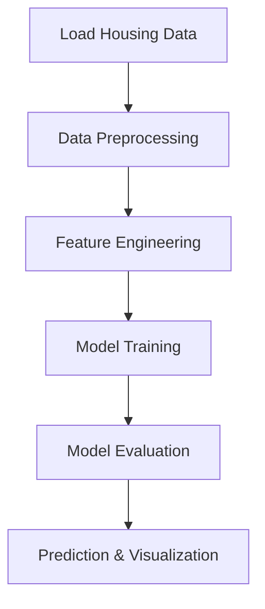

# AI House Price Prediction

## Overview
This project predicts house prices using machine learning models. The goal is to provide accurate price estimates based on property features, supporting real estate analysis and decision-making.

## Architecture / Workflow



## Project Structure

- **HousePrediction_4130.py**: Script for house price prediction using regression models.
- **KCHousePrediction.py**: Main script for feature selection, model training, and evaluation on the KC housing dataset.
- **VisualKCHousePrediction.py**: Script for data visualization and model result analysis.
- **PythonTrainingAI_HousePrediction.ipynb**: Jupyter notebook for interactive exploration and model development.
- **PythonTrainingAI_HousePrediction_Generate_house_price_CSV.py**: Script to generate synthetic house price data.
- **austinHousingData.csv, houses_price.csv, kc_house_data.csv**: Example datasets for model training and testing.

## Setup

1. Ensure Python 3.x is installed.
2. Install required libraries:
   ```
   pip install pandas scikit-learn numpy matplotlib seaborn
   ```
3. Place the relevant CSV data files in the project directory.

## Process

1. **Load Data**: Import housing data from CSV files.
2. **Preprocess Data**: Clean and prepare data (handle missing values, encode categorical variables, etc.).
3. **Feature Engineering**: Select and transform features for modeling.
4. **Model Training**: Train regression models (e.g., Linear Regression, Random Forest, Gradient Boosting).
5. **Model Evaluation**: Assess model performance using metrics and visualizations.
6. **Prediction & Visualization**: Generate price predictions and visualize results.

## Output / Results

- Model performance metrics (R², MAE, RMSE).
- Visualizations of feature importance and prediction results.
- CSV or printed output of predicted house prices.

## Technologies Used

- Python (pandas, numpy)
- scikit-learn
- matplotlib, seaborn
- Jupyter Notebook
