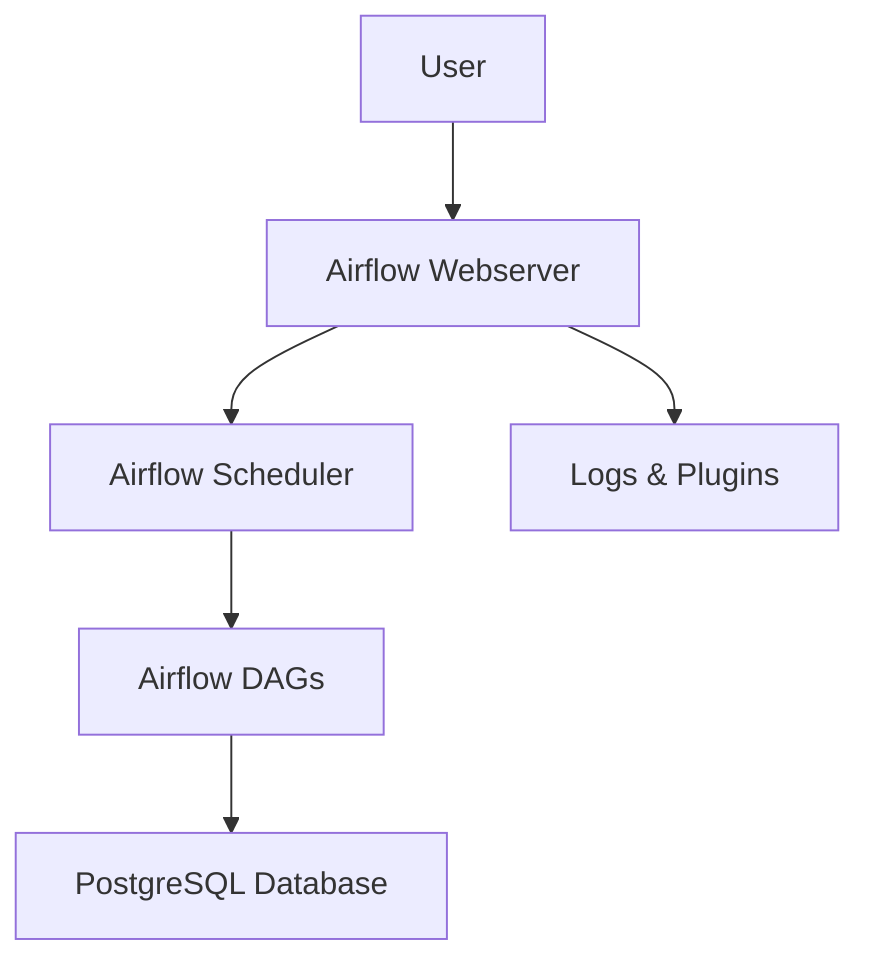

# Airflow + PostgreSQL Orchestration

## Overview
This project provides a local orchestration environment using Apache Airflow and PostgreSQL, enabling the development, scheduling, and monitoring of ETL workflows.

## Architecture / Workflow



## Project Structure

- **docker-compose.yml**: Docker Compose file to set up Airflow and PostgreSQL services.
- **dags/**: Directory for Airflow DAG definitions (ETL workflows).
- **logs/**: Stores Airflow logs.
- **plugins/**: Custom Airflow plugins.
- **pyenv/**, **py_env/**: Python environment directories (if needed for custom operators/plugins).

## Setup

1. Install [Docker](https://www.docker.com/) and [Docker Compose](https://docs.docker.com/compose/).
2. In the project directory, start the services:
   ```
   docker-compose up -d
   ```
3. Access Airflow UI at [http://localhost:8181](http://localhost:8181) (default login: admin/admin).

## Process

1. **Define DAGs**: Place your ETL workflow Python files in the `dags/` directory.
2. **Start Services**: Use Docker Compose to launch Airflow and PostgreSQL.
3. **Monitor & Manage**: Use the Airflow web UI to trigger, monitor, and manage workflows.
4. **Logs & Plugins**: Check `logs/` for execution logs and `plugins/` for custom extensions.

## Output / Results

- Scheduled and on-demand ETL workflow execution.
- Logs for all DAG runs and tasks.
- Data persisted in the PostgreSQL database.

## Technologies Used

- Apache Airflow
- PostgreSQL
- Docker, Docker Compose
- Python
