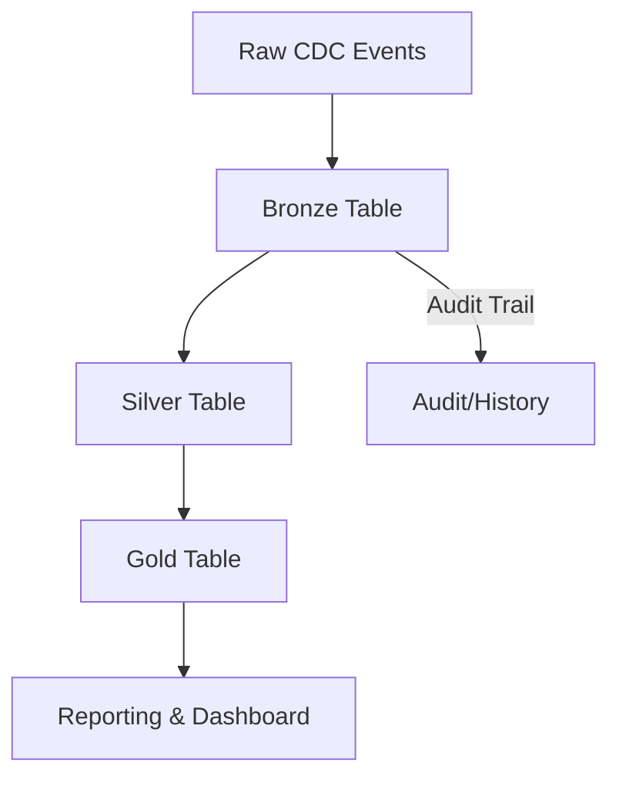

# CDC Databricks Medallion Architecture

## Overview
This project demonstrates a Change Data Capture (CDC) pipeline using the Databricks Medallion Architecture (Bronze, Silver, Gold layers). The goal is to ingest, process, and aggregate customer data changes for robust analytics and reporting.

## Architecture / Workflow

- **Bronze**: Stores raw CDC events for full auditability.
- **Silver**: Maintains the current state of each record after applying CDC changes.
- **Gold**: Aggregates and summarizes data for business reporting.

## Project Structure

- **00_setup_M.py**: Sets up Delta tables and environment.
- **01_bronze_ingestion_M.py**: Ingests initial data into the Bronze layer.
- **01_load_initial_data_M.py / 01_load_initial_data_kafka.py**: Loads initial customer data (optionally via Kafka).
- **02_silver_merge_M.py / 02_silver_merge.py**: Applies CDC changes to create the Silver table (current state).
- **02_silver_transformation_M.py**: Additional transformations for Silver layer.
- **03_gold_aggregate.py / 03_gold_aggregation_M.py / 03_gold_aggregation.py**: Aggregates data for the Gold layer.
- **04_simulate_cdc_changes.py / 04_simulate_changes_M.py**: Simulates CDC events (insert, update, delete).
- **05_create_workflow.py**: Orchestrates the CDC pipeline as a Databricks workflow.
- **08_cdc_dashboard.py**: Dashboard for visualizing Gold layer results.
- **verification.py**: Utility for data validation and checks.

## Setup

1. Ensure you have access to a Databricks workspace with Unity Catalog enabled.
2. Upload project files to your Databricks workspace.
3. Configure your catalog and schema in the setup scripts.
4. Run the notebooks/scripts in the following order:
   - 00_setup_M.py
   - 01_load_initial_data_M.py or 01_load_initial_data_kafka.py
   - 02_silver_merge_M.py
   - 03_gold_aggregate.py
   - 04_simulate_cdc_changes.py
   - 02_silver_merge_M.py (re-run)
   - 03_gold_aggregate.py (re-run)

## Process

1. **Setup**: Create Delta tables and environment.
2. **Bronze Ingestion**: Load raw CDC events.
3. **Silver Merge**: Apply CDC logic to maintain current state.
4. **Gold Aggregation**: Summarize for reporting.
5. **CDC Simulation**: Generate and process change events.
6. **Workflow Orchestration**: Automate the pipeline with Databricks Jobs.
7. **Dashboarding**: Visualize results from the Gold layer.

## Output / Results

- Delta tables for Bronze, Silver, and Gold layers.
- Aggregated metrics and dashboards for business insights.
- Full audit trail of all CDC events.

## Technologies Used

- Databricks (PySpark, Delta Lake)
- Unity Catalog
- Python
- Databricks Jobs/Workflows
