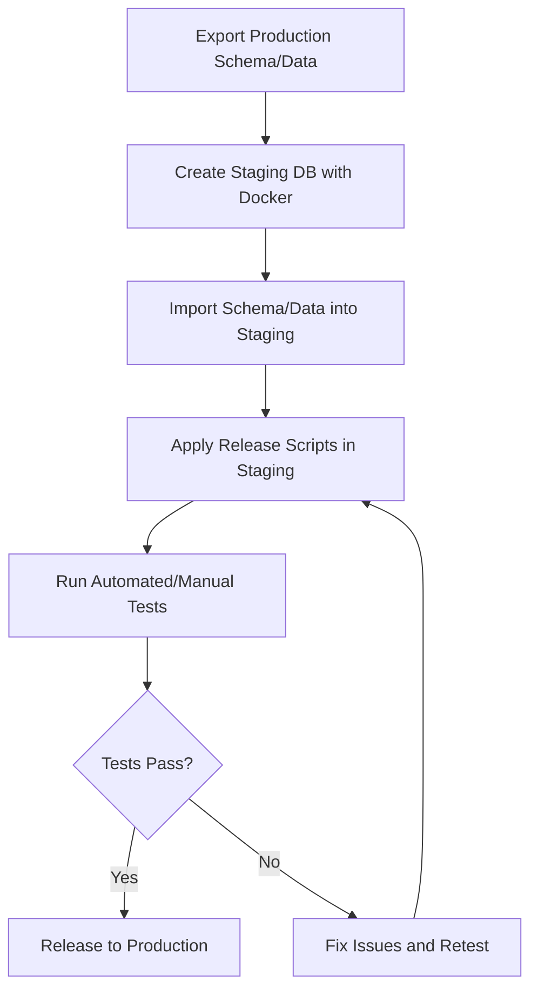

# INE(ISOLATED NETWORK ENVIRONMENT)
# Database Release Staging & Automation
## Release Flow Overview



## Why Staging?
Testing database release scripts in development often misses issues that only appear in production due to differences in data, dependencies, or configuration. To prevent production failures, always validate releases in a staging environment that closely matches production.

## Technical Stack
- **Databases:** Oracle, PostgreSQL, MySQL (match your production DB)
- **Containers:** Docker, Docker Compose
- **Scripting:** Bash (Linux/macOS), Batch (Windows), PowerShell (optional)
- **Testing:** Manual SQL, Automated scripts, Integration/unit tests

## Workflow

### 1. Export Production Schema/Data
- Use DB tools (e.g., expdp/impdp for Oracle, pg_dump/pg_restore for PostgreSQL) to export schema and (optionally) sanitized data from production.

### 2. Create Staging Environment with Docker
- Use Docker Compose to spin up a containerized DB instance matching production (same version/config).
- Mount/init scripts or import dump into the container.

### 3. Apply Release Scripts in Staging
- Run your DDL/DML/TML release scripts in the staging container.
- Validate with automated/manual tests.

### 4. If Staging Succeeds, Release to Production
- Confidently apply the same scripts to production, knowing they work in a production-like environment.

## Example Directory Structure
```
db-release-testing/
  docker/
    Dockerfile
    docker-compose.yml
    config/
      postgresql.conf
      pg_hba.conf
  schema/
    baseline/
    migrations/
  data/
    reference_data/
    production_snapshot/
  releases/
    release_YYYY_MM/
  scripts/
    build/
    test/
  tests/
  logs/
  reports/
  docs/
```

## Automation Scripts
- Scripts to export/import schema/data.
- Scripts to build/start Docker containers.
- Scripts to run tests and validate the release.

## Benefits
- Staging DB matches production as closely as possible.
- Catches issues before production release.
- Repeatable, automated, and safe.

---

The Docker container runs an isolated instance of the database.
all changes are local to the container database.
Production database remains unchanged and safe.
