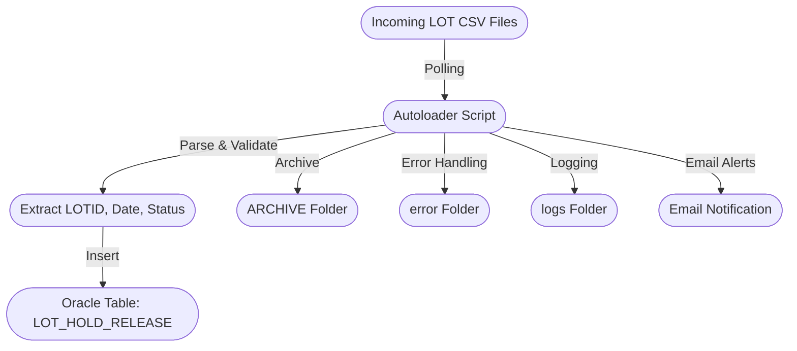

# LOT Release File Autoloader

## Project Description
The LOT Release File Autoloader is a modern, enterprise-grade solution designed to automate the ingestion, validation, and processing of LOT release files into Oracle databases. This Python-based platform replaces legacy Tibco Business workflows, addressing key limitations such as scalability, maintainability, and integration flexibility.

## Key Features & Advantages
- Automated polling and processing of incoming LOT release files, ensuring real-time data updates.
- Robust error handling: files with missing or invalid values are automatically moved to an error folder, with detailed logging and email alerts for rapid issue resolution.
- Seamless integration with Oracle databases, supporting secure and reliable data insertion.
- Modular architecture: easily extendable for new data formats, business rules, or downstream systems.
- Enterprise-grade logging and audit trails for compliance and operational transparency.
- Configurable email notifications for operational and error events.

## Cloud & Future-Ready
- Designed for easy migration to AWS, Databricks, or other cloud platforms.
- Supports containerization and orchestration (e.g., Docker, Kubernetes) for scalable deployment.
- Can leverage cloud storage (S3), serverless compute (Lambda), and managed databases for cost-effective, resilient operations.
- Ready for integration with modern data pipelines, analytics, and AI/ML workflows.

## Business Impact
- Eliminates manual intervention and reduces operational risk.
- Accelerates data availability for business analytics and reporting.
- Provides a foundation for digital transformation and cloud adoption, enabling future enhancements and integrations.

---

## Architecture / Workflow

## Project Structure
- **autoloader.py**: Main script for polling, parsing, loading, archiving, and error handling.
- **config.py**: Centralized configuration for folders, polling, Oracle DB, email, etc.
- **ARCHIVE/**: Stores successfully processed files.
- **error/**: Stores files that failed validation or processing.
- **logs/**: Contains log files for audit and troubleshooting.
- **FileAutoLoaderSetupCodings.docx, SetupCodings.docx**: Documentation for setup and coding standards.
- **requirements**: Python dependencies.

## Setup
1. Install Python 3.x and required libraries (see requirements).
2. Configure Oracle database and email settings in `config.py`.
3. Set up the folder structure as shown above.
4. Schedule `autoloader.py` to run as a service or cron job.

## Process
1. **Monitor**: Poll input folders for new CSV files at a set interval.
2. **Parse & Validate**: Extract LOTID, event date, and status; validate file contents.
3. **Load**: Insert valid data into the Oracle `LOT_HOLD_RELEASE` table.
4. **Archive/Error**: Move processed files to ARCHIVE or error folder.
5. **Log & Alert**: Record all actions in logs and send email alerts for errors.

## Output / Results
- LOT release events loaded into Oracle database.
- Archived and error files for traceability.
- Detailed logs and email notifications for each polling cycle and file processed.

## Technologies Used
- Python
- Oracle Database
- oracledb (Python library)
- Logging, Email (smtplib, MIME)
- Windows OS (file system, scheduling)
- Cloud-ready (AWS, Databricks, Docker, Kubernetes)